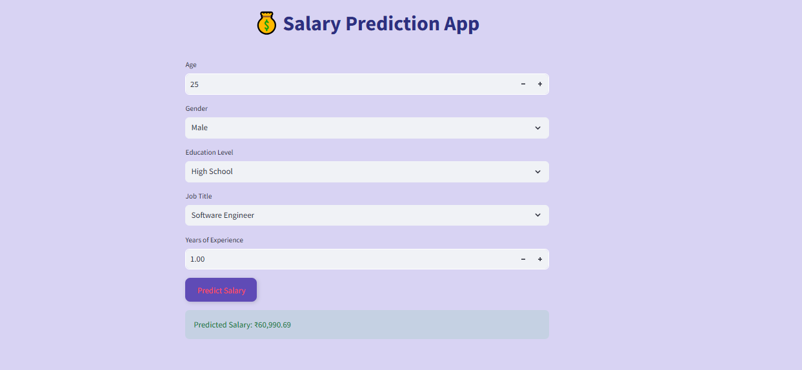

# 💼 AI Salary Predictor App

This is a simple AI-powered web app built using **Streamlit** and **Machine Learning** to predict employee salaries based on user inputs such as age, gender, education level, job title, and years of experience.

## 📸 App Preview



## 📌 Features

- Predicts salary using a trained ML model
- User-friendly form to collect input data
- Instant prediction result display

  ## 🧠 Tech Stack

- Python 🐍
- Pandas & Scikit-learn (for ML pipeline)
- Streamlit (for web interface)
- Pickle (for model saving/loading)
- VS Code (IDE)

## 🛠 How to Run Locally

1. Clone this repository:
    ```bash
    git clone https://github.com/Mariyasheikh/SalaryPredictorApp.git
    cd SalaryPredictorApp
    ```

2. Create a virtual environment (optional but recommended):
    ```bash
    python -m venv venv
    venv\Scripts\activate  # for Windows
    ```

3. Install dependencies:
    ```bash
    pip install -r requirements.txt
    ```

4. Run the Streamlit app:
    ```bash
    streamlit run app.py

 ## 🙋‍♀️ Author

Mariya Sheikh 
🔗 [GitHub Profile](https://github.com/Mariyasheikh)
